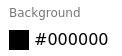

# `<ColorInput> and <ColorField>`

A color picker for [react-admin](https://github.com/marmelab/react-admin) using [React Color](http://casesandberg.github.io/react-color/), a collection of color pickers.


Also includes a color field for just displaying the color value.



## Installation

```sh
npm install @palustris/ra-color-input --save-dev
```

## Usage

```js
import React from 'react';
import {
    Show,
    TextField,
    Edit,
    TextInput,
    LongTextInput,
} from 'react-admin';

import { ColorField, ColorInput } from 'ra-color-input';

export const PostShow = (props) => (
    <Show {...props}>
        <TextField source="title" />
        <TextField source="body" />
        <ColorField source="color" />
    </Edit>
);

export const PostEdit = (props) => (
    <Edit {...props}>
        <TextInput source="title" validation={{ required: true }} />
        <LongTextInput source="body" validation={{ required: true }} />
        <ColorInput source="color" />
    </Edit>
);
```

You can customize the color picker using the `picker` attribute.

```js
<ColorInput source="color" picker="Sketch"/>
```

### Pickers
- Alpha
- Block
- Chrome (default)
- Circle
- Compact
- Github
- Hue
- Material
- Photoshop
- Sketch
- Slider
- Swatches
- Twitter

## License

This library is licensed under the [MIT Licence](LICENSE).
